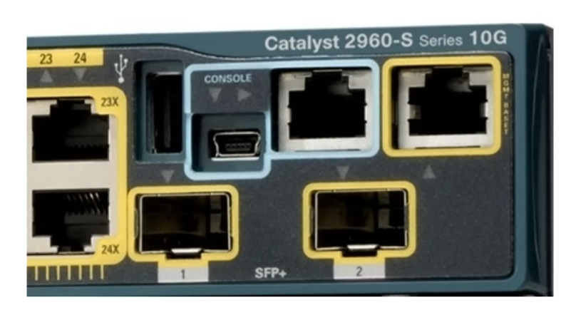
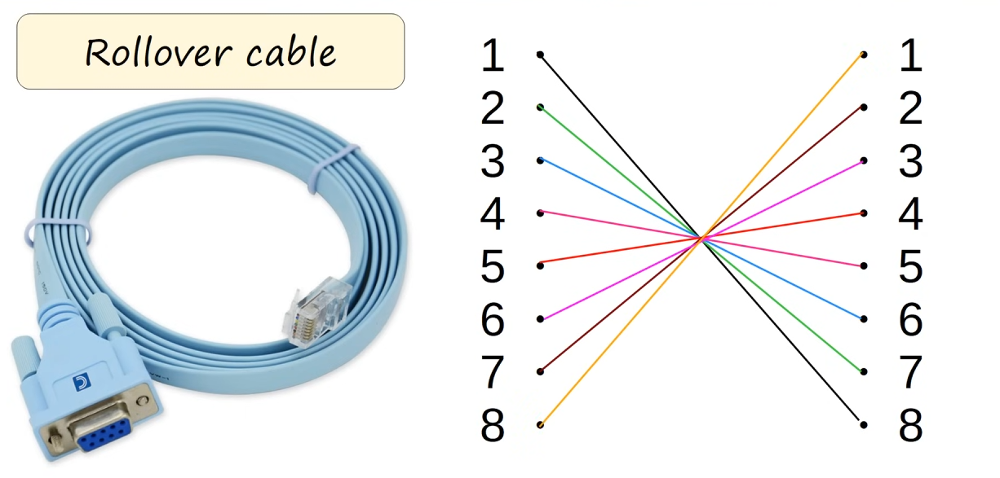

# Intro to Cisco CLI

## Table of contents

* [Cisco IOS](#cisco-ios)
* [How to connect to a Cisco device](#how-to-connect-to-a-cisco-device)
* [CLI](#cli)
* [EXEC Modes](#exec-modes)
* [Enabling Password](#enabling-password)
* [running-config / startup-config](#running-config--startup-config)
* [Saving the configuration](#saving-the-configuration)
* [Password encryption](#password-encryption)

## Cisco IOS

Operating system used on Cisco devices for configuration.

## How to connect to a Cisco device

### Console Port

This typically implies taking your laptop to the device and connecting to the `console port` of the device.



* when you first configure a device **you have to connect to the console port**.
* you need a `Rollover Cable` to connect to your computer (and most likely an adapter)



#### Rollover cable PIN connections

```log
1 --- 8
2 --- 7
3 --- 6
4 --- 5
5 --- 4
6 --- 3
7 --- 2
8 --- 1
```

### Accessing the CLI

A terminal emulator is needed (i.e. [Putty](https://putty.org/)).

#### Default settings

The default settings are usually enough to connect to most devices, so for the purpose of CCNA we only care about the default values.

```log
Speed (Baud rate) = 9600
Data bits         = 8
Stop bits         = 1
Parity            = None
Flow control      = None
```

where:

* `Speed` is bits/s
* for each 8 `Data bits` of data 1 `Stop bit` is sent
* `Parity`: used to detect errors
* `Flow control`: controls the flow of data from transmitter to receiver


<details>

<summary>First-time boot greeting screen</summary>

```log
System Bootstrap, Version 15.1(4)M4, RELEASE SOFTWARE (fc1)
Technical Support: http://www.cisco.com/techsupport
Copyright (c) 2010 by cisco Systems, Inc.
Total memory size = 512 MB - On-board = 512 MB, DIMM0 = 0 MB
CISCO2911/K9 platform with 524288 Kbytes of main memory
Main memory is configured to 72/-1(On-board/DIMM0) bit mode with ECC disabled

Readonly ROMMON initialized

program load complete, entry point: 0x80803000, size: 0x1b340
program load complete, entry point: 0x80803000, size: 0x1b340

IOS Image Load Test
___________________
Digitally Signed Release Software
program load complete, entry point: 0x81000000, size: 0x3bcd3d8
Self decompressing the image :
######################### [OK]
Smart Init is enabled
smart init is sizing iomem
                  TYPE      MEMORY_REQ
     Onboard devices &
          buffer pools      0x022F6000
-----------------------------------------------
                TOTAL:      0x022F6000
Rounded IOMEM up to: 36Mb.
Using 6 percent iomem. [36Mb/512Mb]

              Restricted Rights Legend

Use, duplication, or disclosure by the Government is
subject to restrictions as set forth in subparagraph
(c) of the Commercial Computer Software - Restricted
Rights clause at FAR sec. 52.227-19 and subparagraph
(c) (1) (ii) of the Rights in Technical Data and Computer
Software clause at DFARS sec. 252.227-7013.

           cisco Systems, Inc.
           170 West Tasman Drive
           San Jose, California 95134-1706

Cisco IOS Software, C2900 Software (C2900-UNIVERSALK9-M), Version 15.1(4)M5, RELEASE SOFTWARE (fc2)Technical Support: http://www.cisco.com/techsupport
Copyright (c) 1986-2007 by Cisco Systems, Inc.
Compiled Wed 18-Jul-07 04:52 by pt_team
Image text-base: 0x2100F918, data-base: 0x24729040

This product contains cryptographic features and is subject to United
States and local country laws governing import, export, transfer and
use. Delivery of Cisco cryptographic products does not imply
third-party authority to import, export, distribute or use encryption.
Importers, exporters, distributors and users are responsible for
compliance with U.S. and local country laws. By using this product you
agree to comply with applicable laws and regulations. If you are unable
to comply with U.S. and local laws, return this product immediately.

A summary of U.S. laws governing Cisco cryptographic products may be found at:
http://www.cisco.com/wwl/export/crypto/tool/stqrg.html

If you require further assistance please contact us by sending email to
export@cisco.com.

Cisco CISCO2911/K9 (revision 1.0) with 491520K/32768K bytes of memory.
Processor board ID FTX152400KS
3 Gigabit Ethernet interfaces
DRAM configuration is 64 bits wide with parity disabled.
255K bytes of non-volatile configuration memory.
249856K bytes of ATA System CompactFlash 0 (Read/Write)

Press RETURN to get started!
```

</details>

## CLI

As shown in the following example, there is an `autocomplete` feature

```log
Router>e
% Ambiguous command: "e"

Router>e?
enable  exit

Router>en
Router#
```

To see how a command is used, you can add a `?` at the end (notice the space before the question mark)

```log
Router(config)#enable password?
password  
Router(config)#enable password ?
  7      Specifies a HIDDEN password will follow
  LINE   The UNENCRYPTED (cleartext) 'enable' password
  level  Set exec level password
Router(config)#
```

`<cr>` (carriage return) will be displayed when the only option is to press ENTER

```log
Router(config)#enable password TEST ?
  <cr>
Router(config)#
```

## EXEC Modes

### User EXEC Mode

* the name of the device is followed by a `>` in this mode 🔥
* very limited
* can't make changes to the config
* also called `user mode`

#### Available commands

```log
Router>?
Exec commands:
  <1-99>      Session number to resume
  connect     Open a terminal connection
  disable     Turn off privileged commands
  disconnect  Disconnect an existing network connection
  enable      Turn on privileged commands
  exit        Exit from the EXEC
  logout      Exit from the EXEC
  ping        Send echo messages
  resume      Resume an active network connection
  show        Show running system information
  ssh         Open a secure shell client connection
  telnet      Open a telnet connection
  terminal    Set terminal line parameters
  traceroute  Trace route to destination
Router>
```

### Privileged EXEC Mode

If you enter the `enable` command in user mode you will be placed in `Privileged EXEC Mode`

```log
Router>enable
Router#
```

* complete access to view device's config, restart the device, etc
* **cannot change config**, only time on the device, save the config file, etc 🔥

#### Available commands

```log
Router#?
Exec commands:
  <1-99>      Session number to resume
  auto        Exec level Automation
  clear       Reset functions
  clock       Manage the system clock
  configure   Enter configuration mode
  connect     Open a terminal connection
  copy        Copy from one file to another
  debug       Debugging functions (see also 'undebug')
  delete      Delete a file
  dir         List files on a filesystem
  disable     Turn off privileged commands
  disconnect  Disconnect an existing network connection
  enable      Turn on privileged commands
  erase       Erase a filesystem
  exit        Exit from the EXEC
  logout      Exit from the EXEC
  mkdir       Create new directory
  more        Display the contents of a file
  no          Disable debugging informations
  ping        Send echo messages
  reload      Halt and perform a cold restart

Router#
```

### Global Configuration Mode

```log
Router>enable
Router#configure terminal
Enter configuration commands, one per line.  End with CNTL/Z.
Router(config)#
```

## Enabling Password

```log
Router>
Router>enable
Router#configure terminal
Enter configuration commands, one per line.  End with CNTL/Z.
Router(config)#enable password TEST
Router(config)#exit
Router#
%SYS-5-CONFIG_I: Configured from console by console

Router#exit
```

```log
Router>enable
Password: 
Router#
```

## running-config / startup-config

* There are the two config files kept on the device at any given time
* `running-config`: active config file on the device. As you enter commands in the CLI, you edit the active config file.
* `startup-config`: config file that will be loaded upon restart of the device

### `show running-config`

```log
Router#show running-config
Building configuration...

Current configuration : 715 bytes
!
version 15.1
no service timestamps log datetime msec
no service timestamps debug datetime msec
no service password-encryption
!
hostname Router
!
!
!
enable password TEST
!
!
!
!
!
!
ip cef
no ipv6 cef

Router#
```

### `show startup-config`

```log
Router#show startup-config
Using 694 bytes
!
version 15.1
no service timestamps log datetime msec
no service timestamps debug datetime msec
no service password-encryption
!
hostname Router
!
!
!
!
!
!
!
!
ip cef
no ipv6 cef
!
!
!
!

Router#
```

## Saving the configuration

There are 3 ways to save the configuration

* `write`

    ```log
    Router#write
    Building configuration...
    [OK]
    Router#
    ```

* `write memory`

    ```log
    Router#write memory
    Building configuration...
    [OK]
    Router#
    ```

* `copy running-config startup-config`

    ```log
    Router#copy running-config startup-config
    Destination filename [startup-config]? 
    Building configuration...
    [OK]
    Router#
    ```

## Password encryption

Password are stored in `plain text by default`. 🔥🔥🔥

### `service password-encryption` command

This commannd will use the `7` encryption algorithm for passwords, it is a proprietary encryption algorithm from Cisco.

* `7` is **NOT** a secure encryption algorithm 🔥🔥🔥

```logs
Router(config)#service password-encryption
Router(config)#
```

* `show running-config` **BEFORE** `service password-encryption`:

    ```log
    ...
    enable password TEST
    ...
    ```

* `show running-config` **AFTER** `service password-encryption`:

    ```log
    ...
    enable password 7 0815697D3D
    ...
    ```

### `enable secret` command

This command will result in an MD5 encrypted password instead. Old passwords will remain in the config but will not be valid.

```log
Router(config)#enable secret ANOTHERTEST
Router(config)#
```

* `show running-config` **AFTER** `enable secret`:

    ```log
    enable secret 5 $1$mERr$E6LHX/t.CDvQzXJY58S/l.
    enable password 7 0815697D3D
    ```
