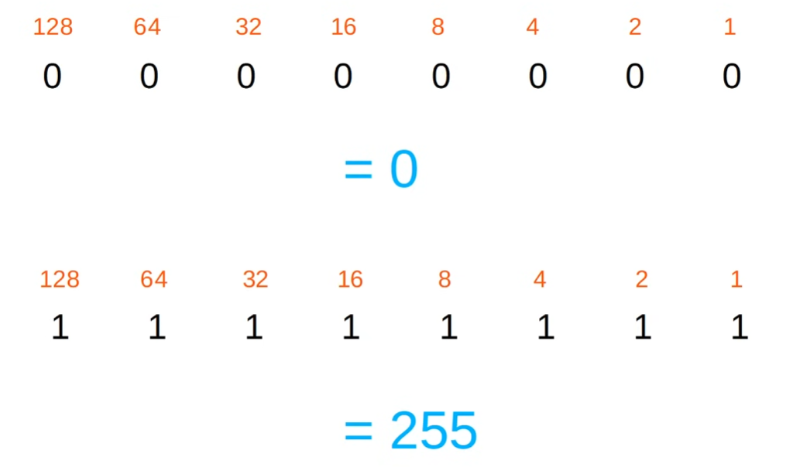
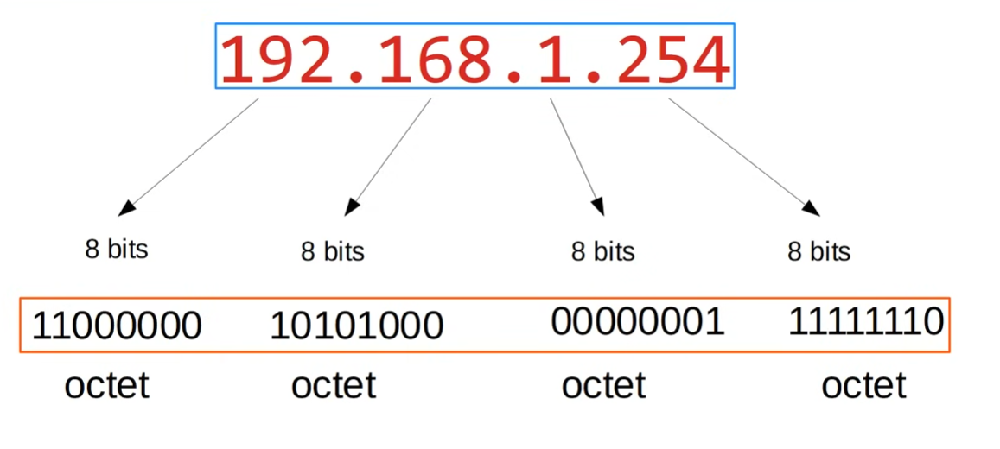
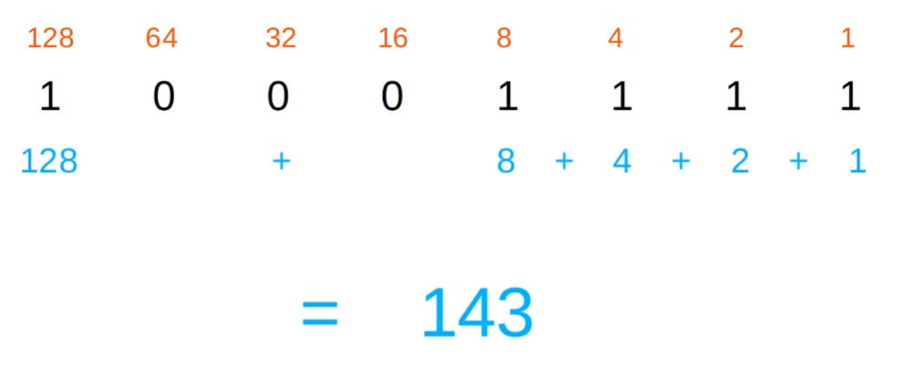
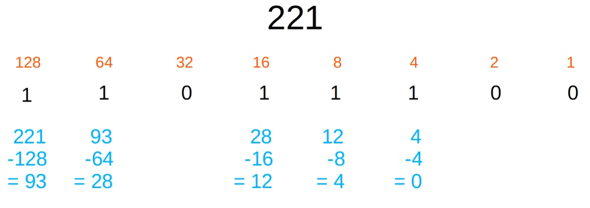
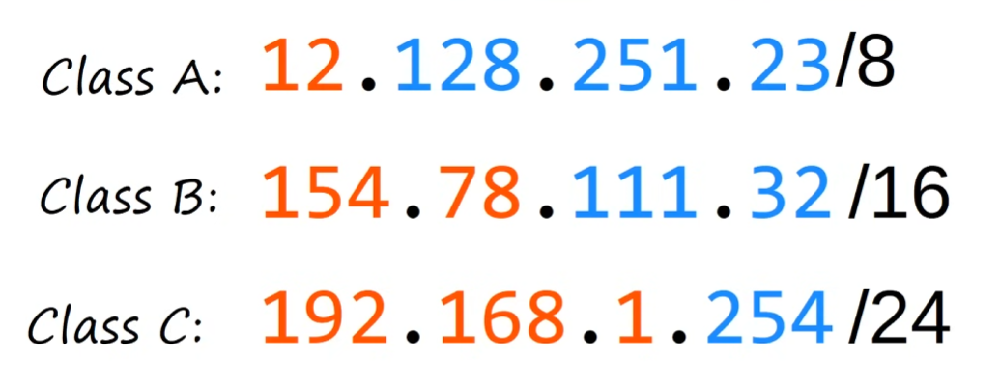
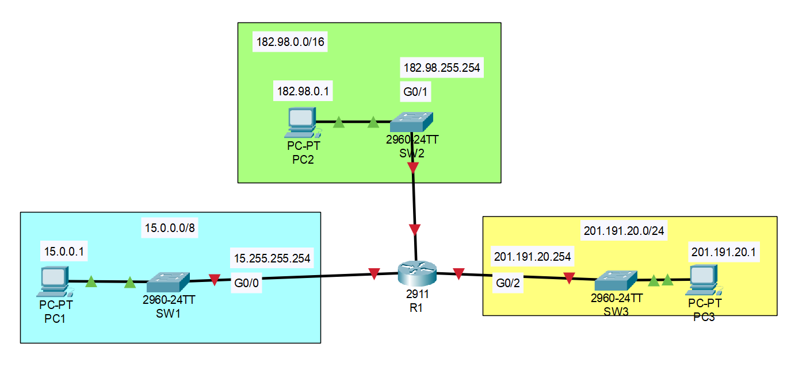

# IPv4 Addressing


## Table of contents
* [IPv4 Address](#ipv4-address)
* [Decimal and Binary](#decimal-and-binary)
* [IPv4 Address Classes](#ipv4-address-classes)
* [IPv4 Address Configuration](#ipv4-address-configuration)


## IPv4 Address

* `32 bits` / `4 bytes`
* We use **dotted decimal** instead of binary for ease of use
    * `192.168.1.254` = `11000000.10101000.00000001.11111110`
* **CIDR notation**: `/24` after the IP number indicates `24` out of the `32` bits in an IP address correspond to the network portion. Possible values are `1 > n > 32` where `n` is an integer. 🔥🔥🔥
    * i.e `192.168.1.0/24`


## Decimal and Binary






### Binary to Decimal




### Decimal to Binary




## IPv4 Address Classes

| Class | First octet | First octet numeric range |
| :-: | :-: | :-: |
| **A** | 0xxxxxxx | 0-127 (1-126)|
| **B** | 10xxxxxx | 128-191 |
| **C** | 110xxxxx | 192-223 |
| **D** | 1110xxxx | 224-239 |
| **E** | 1111xxxx | 240-255 |

* `A` class range is considered to start at `1` because `0` first octet is used reserved
* `A` class range is considered to end at `126` because `127` first octet is used to test the **network stack (l3)** on the local device
* We will focus on `A`, `B` and `C`.
* `D` are multicast addresses
* `E` are reserved (experimental)

| Class | First octet | First octet numeric range | Prefix Length |
| :-: | :-: | :-: | :-: |
| **A** | 0xxxxxxx | 0-127 (1-126)| /8 |
| **B** | 10xxxxxx | 128-191 | /16 |
| **C** | 110xxxxx | 192-223 | /24 |




### Netmask

| Class | Prefix Length | Netmask | Binary octets |
| :-: | :-: | :-: | :-: |
| **A** | /8 | 255.0.0.0 | 11111111 00000000 00000000 00000000 |
| **B** | /16 | 255.255.0.0 | 11111111 11111111 00000000 00000000 |
| **C** | /24 | 255.255.255.0 | 11111111 11111111 11111111 00000000 |


### Maximum hosts per network

**`2^n - 2`** 🔥
> where `n` = number of host bits


#### /24 (Class C)

`192.168.1.0/24` --- `192.168.1.255/24`

* Network portion: **24** bits
* Host portion: **8 bits**
* Therefore *8 bits* -> 2^**8** = 256
* **BUT** `192.168.1.0` is the network address (network id) and `192.168.1.255` is the *broadcast address*
* Therefore max number of hosts is 2^**8** - 2 = 254 🔥


#### /16 (Class B)

`172.16.0.0/16` --- `172.16.255.255/16`

* Network portion: **16** bits
* Host portion: **16 bits**
* Therefore *16 bits* -> 2^**16** = 65536
* **BUT** `172.16.0.0` is the network address (network id) and `172.16.255.255` is the *broadcast address*
* Therefore max number of hosts is 2^**16** - 2 = 65534 🔥


#### /8 (Class A)

`10.0.0.0/8` --- `10.255.255.255/8`

* Network portion: **8** bits
* Host portion: **24 bits**
* Therefore *24 bits* -> 2^**24** = 16777216
* **BUT** `10.0.0.0` is the network address (network id) and `10.255.255.255` is the *broadcast address*
* Therefore max number of hosts is 2^**24** - 2 = 16777214 🔥


### Network address

`192.168.1.0/24`

* `/24` means `192.168.1` is the network portion and `.0` is the host portion
* Since the **host portion** is `0` it means it is the network address
* it is the first address with a **host portion** of all `0`s


### Broadcast address

`192.168.1.255/24`

* last address in the network
* with `/24` net mask it would be the last octet `.255`
* cannot be assigned to a host


## IPv4 Address Configuration

Consider the following network where the router interfaces are yet to be configured:



### Show interfaces status and configured IP addresses

```log
Router>enable
Router#show ip interface brief
Interface              IP-Address      OK? Method Status                Protocol 
GigabitEthernet0/0     unassigned      YES unset  administratively down down 
GigabitEthernet0/1     unassigned      YES unset  administratively down down 
GigabitEthernet0/2     unassigned      YES unset  administratively down down 
Vlan1                  unassigned      YES unset  administratively down down
Router#
```

* 4 Interfaces (`G0/0`, `G0/1`, `G0/2` and `G0/3`)
* No IP addresses assigned
* `OK?` column is a legacy field not used anymore.
* `Method`: method by which the interface was assigned an IP address
* `Status`: **L1 Status of the Interface** 🔥
    * *"Administratively down"* : the interface has been disabled with the `shotdown` command. This is the default status of Cisco router interfaces.
    * Cisco switch interfaces are **NOT** administratively down by default
* `Protocol`: **L2 Status of the interface** 🔥
    * Because the interfaces are `DOWN` at **L1**, **L2** can't operate 🔥


### Configure interface IP

```log
Router#config terminal
Enter configuration commands, one per line.  End with CNTL/Z.
Router(config)#interface gi
Router(config)#interface gigabitEthernet 0/0
Router(config-if)#ip address 15.255.255.254 255.0.0.0
Router(config-if)#no shutdown
Router(config-if)#
%LINK-5-CHANGED: Interface GigabitEthernet0/0, changed state to up

%LINEPROTO-5-UPDOWN: Line protocol on Interface GigabitEthernet0/0, changed state to up

Router(config-if)#
```

* `interface gigabitEthernet 0/0` command to enter `gigabitEthernet 0/0` interface configuration
* `ip address 15.255.255.254 255.0.0.0` to configure the IP address, we need to manually enter the subnet mask :fire:
* `no shutdown` because Cisco router interfaces had the `shutdown` command applied to them by default
* `%LINK-5-CHANGED: Interface GigabitEthernet0/0, changed state to up` indicates the physical layer status of the interface (`Status` column)
* `%LINEPROTO-5-UPDOWN: Line protocol on Interface GigabitEthernet0/0, changed state to up` indicates the L2 status of the interface (`Protocol` column)


We'll do the same for the other 2 interfaces
```log
Router(config-if)#interface gigabitEthernet 0/1
Router(config-if)#ip address 182.98.255.254 255.255.0.0
Router(config-if)#no shutdown

Router(config-if)#
%LINK-5-CHANGED: Interface GigabitEthernet0/1, changed state to up

%LINEPROTO-5-UPDOWN: Line protocol on Interface GigabitEthernet0/1, changed state to up

Router(config-if)#
Router(config-if)#interface gigabitEthernet 0/2
Router(config-if)#ip address 201.191.20.254 255.255.255.0
Router(config-if)#no shutdown

Router(config-if)#
%LINK-5-CHANGED: Interface GigabitEthernet0/2, changed state to up

%LINEPROTO-5-UPDOWN: Line protocol on Interface GigabitEthernet0/2, changed state to up

Router(config-if)#
```

Now we can verify our interfaces are configured and working as expected
```log
Router(config-if)#do show ip interface brief
Interface              IP-Address      OK? Method Status                Protocol 
GigabitEthernet0/0     15.255.255.254  YES manual up                    up 
GigabitEthernet0/1     182.98.255.254  YES manual up                    up 
GigabitEthernet0/2     201.191.20.254  YES manual up                    up 
Vlan1                  unassigned      YES unset  administratively down down
Router(config-if)#
```
