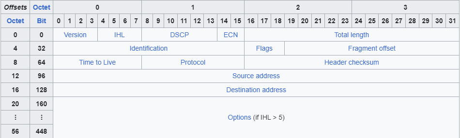

# IPv4 Header

## Fields

* [Version](#version)
* [IHL](#ihl)
* [DSCP](#dscp)
* [ECN](#ecn)
* [Total Length](#total-length)
* [Identification](#identification)
* [Flags](#flags)
* [Fragment Offset](#fragment-offset)
* [Time To Live](#time-to-live)
* [Protocol](#protocol)
* [Header Checksum](#header-checksum)
* [Source and Destination IP Addresses](#source-and-destination-ip-addresses)
* [Options](#options)

## Version

* `4 bits`
* identifies the version of IP used
    * IPv4 = 4 (`0100`)
    * IPv6 = 6 (`0110`)

## IHL

Internet Header Length

* `4 bits`
* indicates total length of the header ([options field](#options) if variable)
* 4-byte increments
    * `5 = 5 * 4-bytes = 20 bytes`
* `5 <= IHL <= 15`

## DSCP

Differentiated Services Codepoint

* `6 bits`
* used for QoS (Quality of Service)
* used to prioritize delay-sensitive data (streaming audio, video, etc)

## ECN

Explicit Congestion Notification

* `2 bits`
* provides e2e notification of network congestion without dropping packets
* optional field that requires both endpoints, as well as the network infra, to support it

## Total Length

* `16 bits`
* indicates the total length of the packet (L3 header + L4 segment)
* measured in bytes
    * `20 = 20 bytes`
* `20 <= Total Length <= 65535`

## Identification

* `16 bits`
* if a packet is fragmented due to being too large, this field is used to identify which packet the fragment belongs to
* all fragments of the same packet will have their own IPv4 header with the same value in this field
* packets are fragmented if larger than the MTU (Maximum Transmission Unit)
* MTU is usually `1500 bytes`
    * same as max size of ethernet frame payload
* fragments are reassembled by the receiving host

## Flags

* `3 bits`
* used to control/identify fragments
* `bit 0` is reserved and always set to 0
* `bit 1` is the **don't fragment** (DF bit), used to indifcate a packet should not be fragmented
* `bit 2` is the **more fragments** (MF bit)
    * `1` if there are more fragments in the packet
    * `0` for the last fragment

## Fragment Offset

* `13 bits`
* indicates position of the fragment within the original unfragmented IP packet
* allows fragmented packets to be reassembled even if the fragments arrive out of order

## Time To Live

* `8 bits`
* a router will drop a packet with a TTL of 0
* used to prevent infinite loops and congestion
* originally designed to indicate the packets maximum lifetime in seconds
* in practice, indicates a *hop count*: each time the packet arrives at a router, the router decreases the TTL by 1
* recommended default TTL is `64`

## Protocol

* `8 bits`
* indicates the protocol of the encapsulated LAYER 4 (Transport) PDU
* `6` = TCP
* `17` = UDP
* `1` = ICMP (ping)
* `89` = OSPF (Open Shortest Path First, dynamic routing protocol)

## Header Checksum

* `16 bits`
* calculated checksum used to check for errors in the IPv4 header
* router receives the packet, calculates the checksum and compares it to the one in this field.
* if they do not match the router drops the package

## Source and Destination IP Addresses

* `32 bits` each
* IPv4 Addresses of the sender and intended receiver of the package

## Options

* `0 - 320 bits`
* rarely used
* if IHL field is greater than `5`, it means that Options are present
