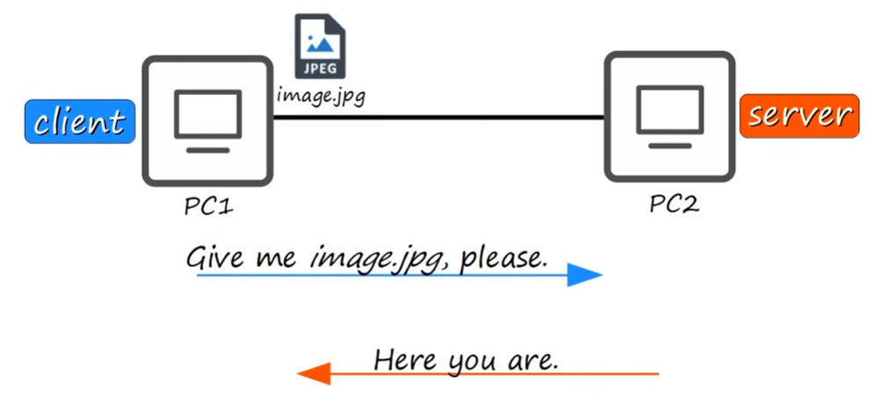
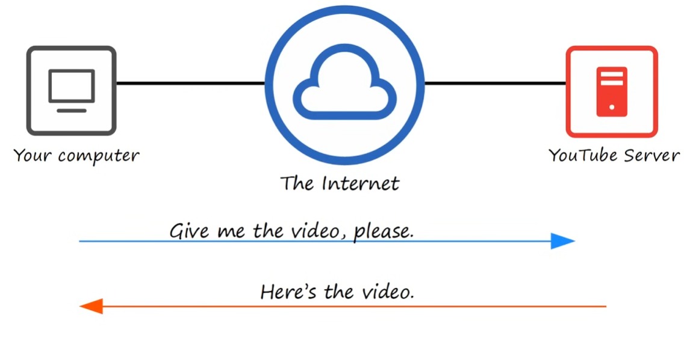
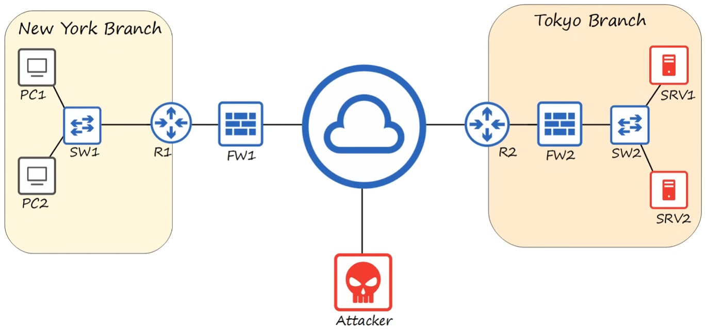

# Network Devices

## Network
A computer network is a digital telecommunications network which allows nodes to share resources

## Server
Device that provides functions or services for clients

## Client
Device that accesses a service made availably by a server

## Switches
You typically don't connect end-hosts or PCs directly to each other, you aggregate the connections to a device called a "switch".

* have many network interfaces/ports for end hosts to connect to (usually 24+)
* provide connectivity to hosts within the same LAN (Local Area Network)
* do not provide connectivity between LANs or over the internet

## Routers
We can connect switches to routers to connect to the internet.

* have fewer network interfaces/ports than switches
* are used to provide connectivity **between** LANs
* used to send data over the internet

## Firewalls
There are potential "attackers" in the internet.
Although router can provide some basic security features, what we should use to protect our networks are firewalls.

* monitor and control network traffic based on configured rules
* can be placed **outside** of your LAN (filter traffic before reaching the router)
* can be placed **inside** of your LAN (filter traffic after going through the router)
* are considered "Next-Gen" when they include more modern and advanced filtering capabilities.

### Host-based firewalls
These are software applications that filter traffic entering and exiting a host machine (like a PC).
Even in a network with a hardware firewall each PC should include a software firewall for an extra protection layer

