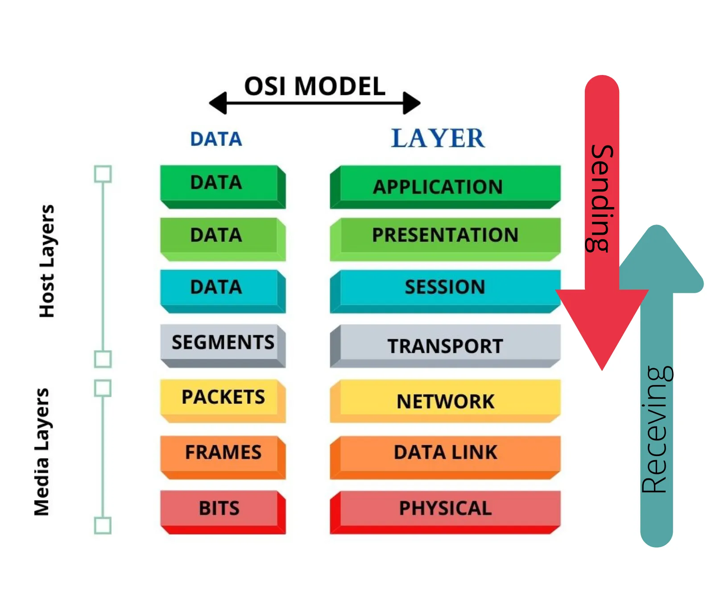
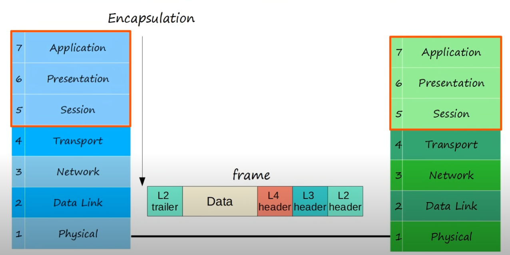
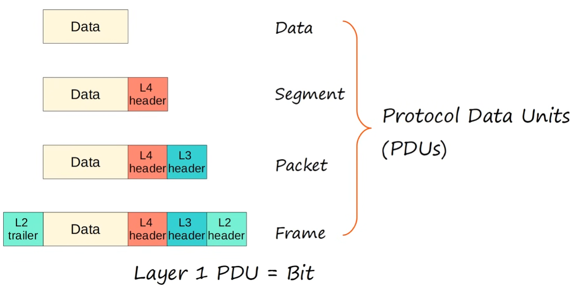
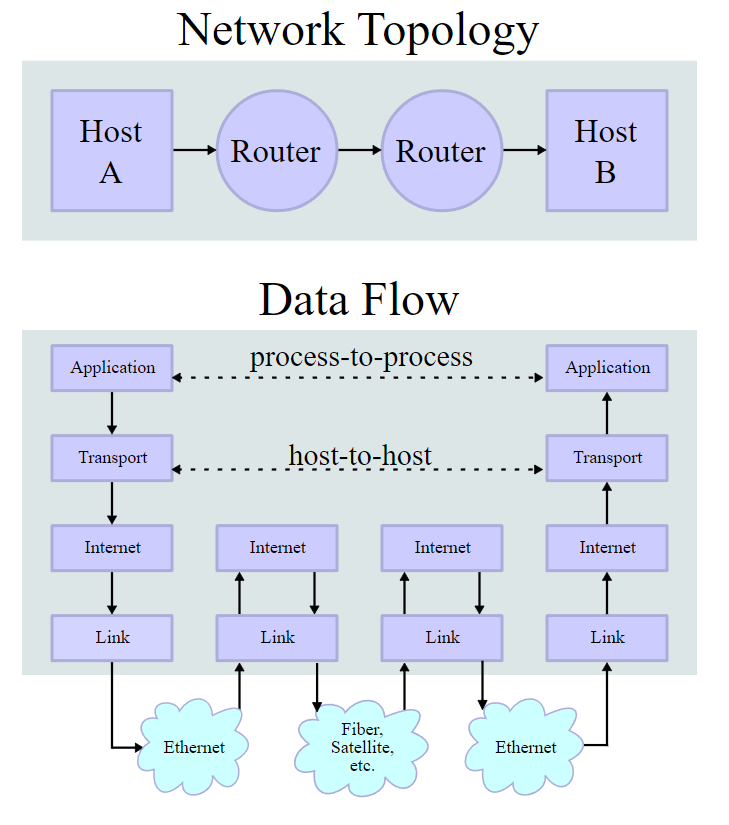

# OSI Model and TCP/IP Suite

## Table of contents
* [Networking models](#networking-models)
* [OSI Model](#osi-model)
* [TCP/IP](#tcpip)

## Networking models
Networking models categorize and provide structure for networking protocols and standards.

## OSI Model
Open Systems Interconnection model

* categorizes and standardizes the different functions in a network
* created by the Internatinal Organization for Standardization (**ISO**)
* Functions are divided into 7 layers
* These layers work together to make the network work

### 7 - Application

* this layer is the closest to the end user
* interacts with software applications (i.e. browsers)
* serves as the window for users and app processes to access network services
* HTTP and HTTPS are Layer 7 protocols
* identifies communication partners
* synchronizes communication

### 6 - Presentation

* translate between application and network formats
* handles encryption and decryption

### 5 - Session

* controls dialogues (sessions) between comunication hosts
* establishes, manages and terminates connections between local and remote app

### 4 - Transport

* segments and reassembles data for communications between end hosts
* breaks large pieces of data into smaller segments which can be more easily sent over the network and are less likely to cause transmission problems if errors occur
* **provides host-to-host communication** (end to end, process to process, etc) :fire:
* **adds a L4 header to the data from L7/L6/L5** forming a **`segment`** :fire:

### 3 - Network

* provides connectivity between end hosts on different networks
* provides logical addressing (IP addresses)
* controls operations of the subnet, deciding physical path the data takes
* **routers operate at Layer 3**
* **adds a L3 header to the segment from L4** forming a **`packet`** :fire:

### 2 - Data Link

* provides node-to-node connectivity and data transfer (i.e. PC to switch, switch to router, router to router)
* defines how data is formatted for transmission over physical medium (like copper UTP cable)
* detects and possibly corrects Physical Layer errors
* uses its own L2 addressing, separate from Layer 3 addressing
* **switches operate at layer 2**
* **adds l2 header AND trailer to packet from L3** forming a **`frame`** :fire:

### 1 - Physical

* defines physical characteristics of the medium used to transfer data between devices (i.e. voltage levels, max tx distances, physical connectors, cable specs, etc)
* digital bits are converted into electrical or radio signals (wired and wireless connections respectively)
* [interfaces and cables](../interfaces_and_cables/) section of this repo is related to this layer

### PDUs (Protocol Data Units)

### OSI funny acronyms

## TCP/IP

* used in the internet and other networks today
* known as TCP/IP becuase those are two of the foundational protocols in the  suite
* developed by the US Department of Defense through DARPA
* similar to OSI model but with fewer layers

