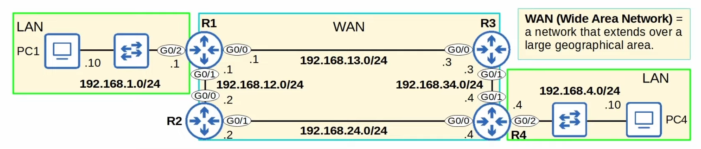
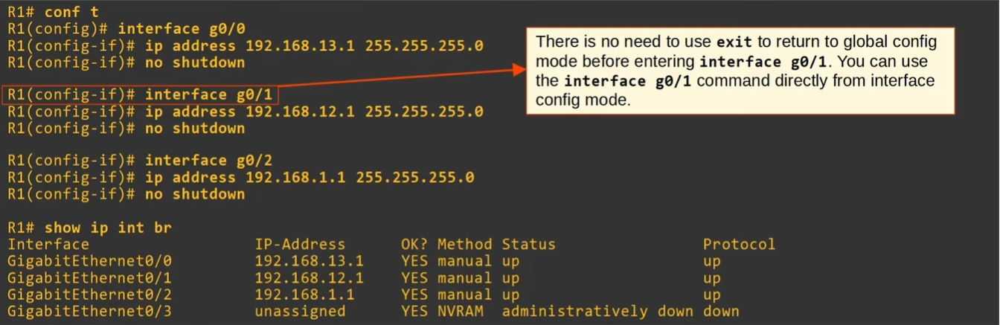
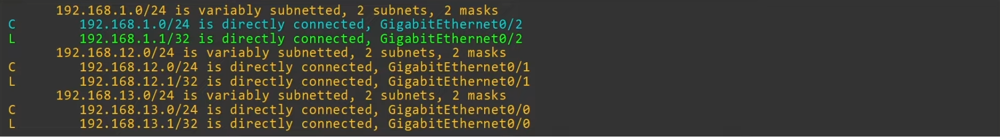
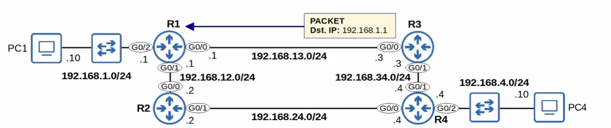
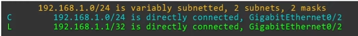

# Routing Fundamentals

Routing is the process that routesrs use to determine the path that IP packets should take over a network to reach their destination.
Routers store routes to all of their known destinations in a routing table.
When routers receibe packets, they look in the routing table to find the best route to forward that packet.

## Routing Methods

There are two main routing methods:

* **Dynamic Routing**: routers use dynamic routing protocols (i.e. OSPF) to share routing information with each other automatically and build their routing tables.

* **Static Routing**: a network engineer/admin manually configures routes on the router

## Route

A route tells the router to:

* send a packet to destination X, you should send the package to next-hop Y
    * `next-hop` = the next router in the path to the destination
* send the packet directly to the destination (if it is directly connected to the router)
* receive the packet for yourself (if the destination is the router's own IP address)

## Routing Tables

### Pre-config

For simplicity we'll only show R1's config.

### Connected and Local routes

* `show ip route` to view routing table 🔥

#### Connected Routes

* Route to the network the interface is connected to
* **R1 G0/2 IP** = `192.168.1.1/24`
* Network address = `192.168.1.0/24`
* It provides a route to all hosts in that network (i.e. *192.168.1.10*, *192.168.1.232*, etc)
* R1 knows: "if I need to send a packet to any host in 192.168.1.0/24, I should send it out to `G0/2`"

#### Local Routes

* Route to the exact IP address configured in the interface
* `/32` netmask is used to specify the exact IP address of the interface
* Even tough R1's G0/2 is configured as `192.168.1.1/24`, the local route is `192.168.1.1/32`
* R1 knows: "if I receive a package destined for this IP address, the message is for me"

## Route Selection

A packet destined for 192.168.1.1 is matched by 2 routes in the example above:

* `192.168.1.0/24`
* `192.168.1.1/32`

It will choose the **most specific** matching route.

* **most specific** matching route = the matching route with the longest prefix length 🔥
