# Static Routing

Consider the following network topology

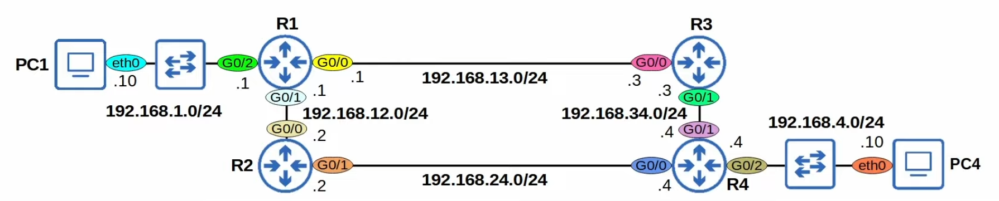

## Default Gateway

To send packets to destinations outside of the transmitter's local network, they must send the packets to their default gateway.

* "gateway" is an old term for "router", so it means "default router".
* the default gateway config is also called "default route"
* it is a route 0.0.0.0/0 = all netmask bits are set to 0. Includes all addresses from `0.0.0.0` to `255.255.255.255` (4,294,967,296 possible IP addresses)
* it is the **least specific** route possible
* End hosts usually have no need for any more specific routes. They just need to know, to send packets outside of their local network, they should send them to theirdefault gateway

## Static Routes

Lets look at the following example where PC1 wants to send something to PC4

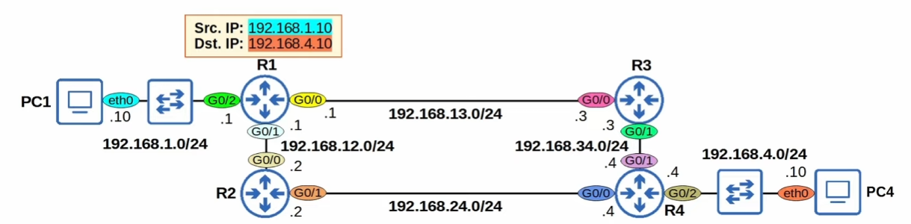

1. PC1 sends a frame through its default gateway (R1)
2. R1 de-encapsulates the frame (look at the packet)
3. R1 will check the routing table for the most-specific matching route
    * The following is R1s routing table atm:

    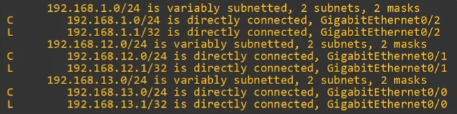
4. R1 has no matching routes in its routing table so it will **drop the packge**

There are two possible path packets from PC1 to PC4 can take:

    * `PC1` --> `R1` --> `R3` --> `R4` --> `PC4`
    * `PC1` --> `R1` --> `R2` --> `R4` --> `PC4`

We will use the former one (**R3**) in this example

Each router in the path needs *two* routes:

1. route to `192.168.1.0/24` (**PC1**'s network)
2. route to `192.168.4.0/24` (**PC4**'s network)

This will ensure **two-way reachability** (PC1 can send packets to PC4 and PC4 can sendd packets to PC1)

* R1 already has a connected route to PC1's network
* R4 already has a connected route to PC4's network
* The other routes must be manually configured (using Static Routes)

This will be the plan for static routes:
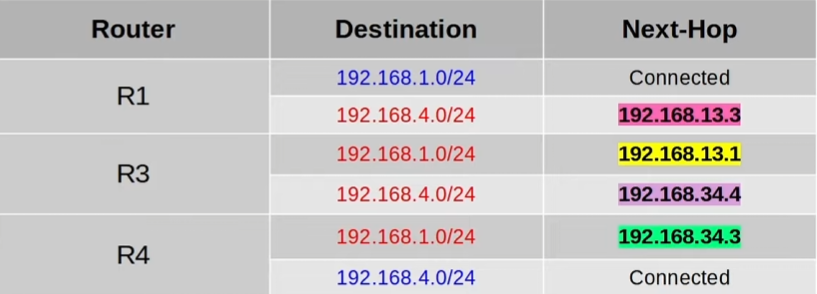

### Static Route Configuration

The command for this is `ip route <ip-address> <netmask> <next-hop>`

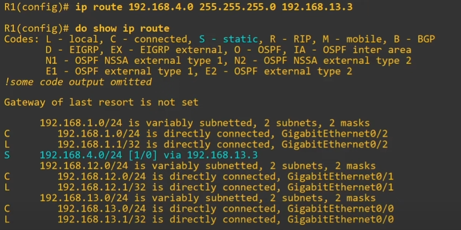

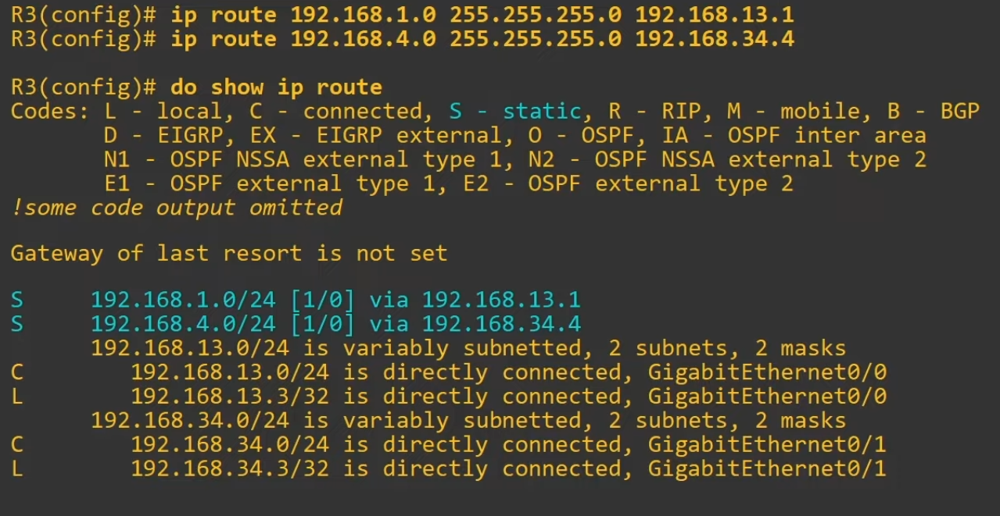

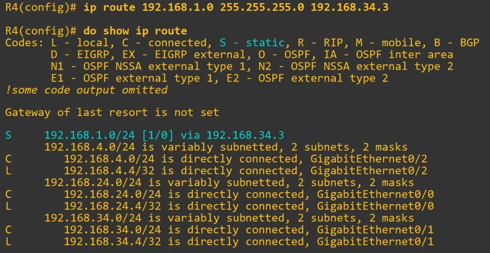

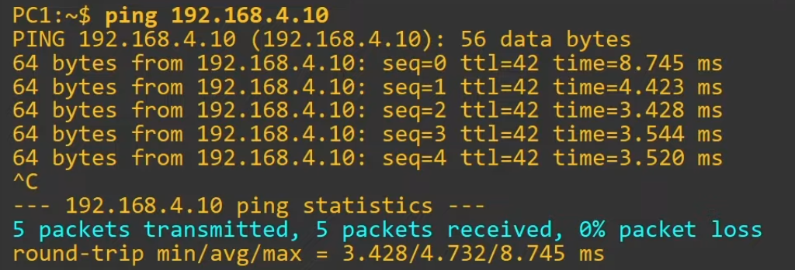

* Packet traveling from PC1 to PC4
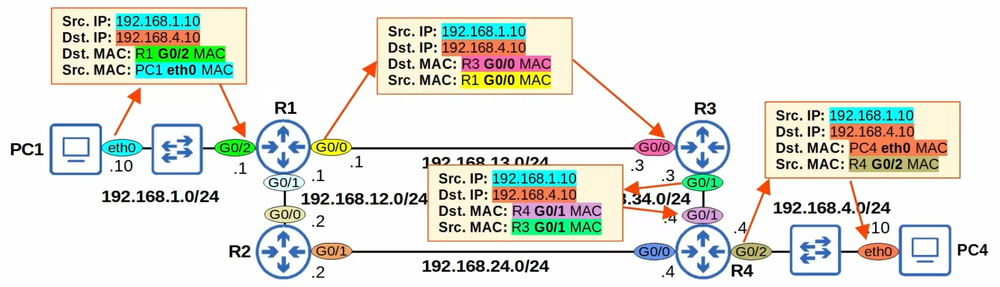

### Static Route Configuration with `exit-interface`

There's two other ways to configure a static route:

* `ip route <ip_address> <netmask> <exit-interface>`
* `ip route <ip_address> <netmask> <exit-interface> <next-hop>`

We'll configure static routes for R2 using there:

* notice that now we also get the interface name specified in the corresponding static route entry
* using **only** the *exit-interface* will show as `is directly connected` instead of explicitely saying `via <ip_address>`
* static routes in which you specify only the *exit-interface* relly on a feature called **Proxy ARP** to function
* neither config method is better than the other

## Default Route (Gateway)

* a default route is 0.0.0.0/0
* often used to direct traffic to the internet
* if the router doesn't have any more specific routes that match a packet's destination IP address, the router will forward the packet using the default route

### Example

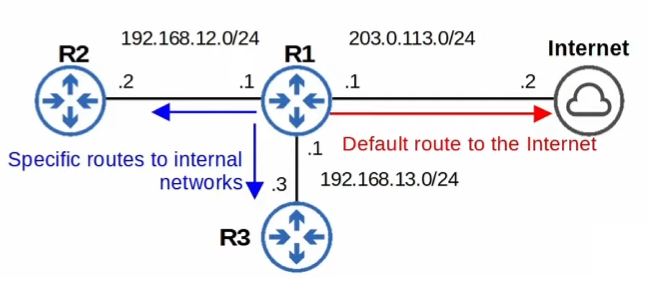

No default route has been configured yet

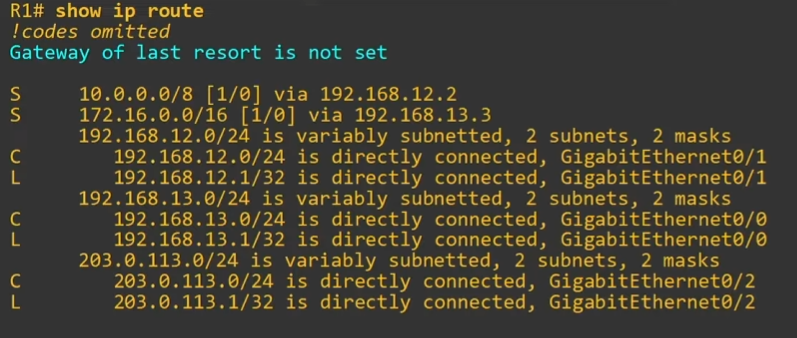

After configuring a default route, routing table automatically picked the best candidate to be the last resort IP address

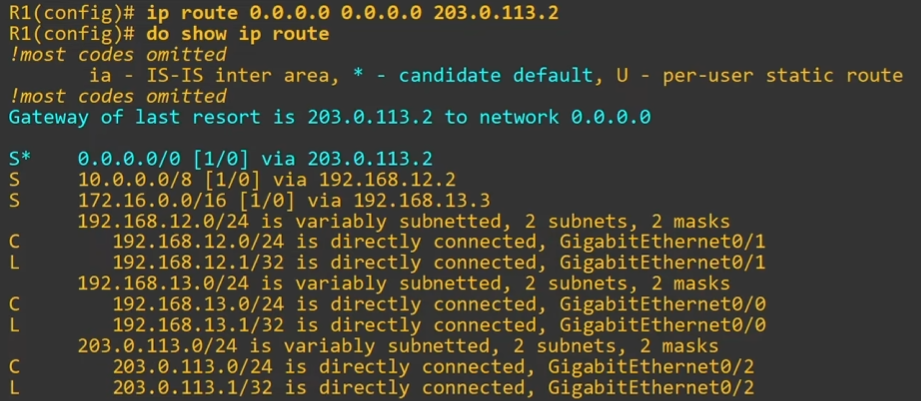
