# Switch Interfaces

## Configuring interfaces

The following is the network topology we'll use for this section
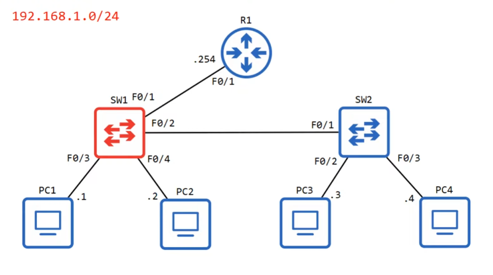

### `show ip interface brief`

Running `show ip interface brief` in *privileged EXEC mode* will do the trick [just like with routers](../ipv4_addressing/README.md#show-interfaces-status-and-configured-ip-addresses)

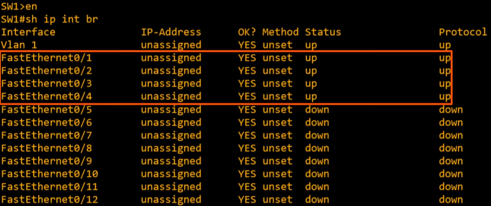

We can already tell a difference between Cisco switches and routers; interfaces do not have the `shutdown` command applied by default. So if you connect them to another device they will usually be in the `status=up and protocol=up` state with no configuration required. 🔥

* interfaces not connected to a device will have `status=down and protocol=down` state by default

### `show interfaces status`

* `name` = `description`
* `Vlan`: they can be used to divide LANs into smaller LANs
    * interface connected to another switch is a trunk interface 🔥
* `Duplex`: indicates whether the device is capable of sending and receiving data at the same time 🔥🔥🔥
    * `full duplex` when capable
    * `half duplex` when not
    * `duplex` is `auto` by default in Cisco switches. Meaning it will negotiate with neighbor device and use full duplex if possible
    * `a-full`: automatically negotiated `full duplex` with connected device
* `Speed`
    * `auto` by default. Meaning it will negotiate with neighbor device and use the fastest speed both devices are capable.
    * `a-100`: automatically negotiated `100Mbps`

### Configuring interface speed and duplex

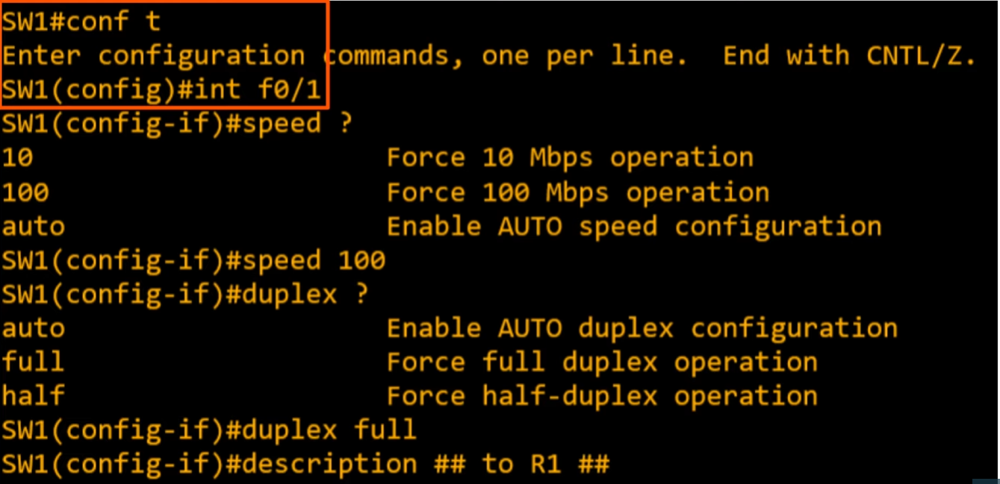

* `interface f0/1` to select **f0/1** interface
* `speed 100` to configure speed to **100Mbps**
* `duplex full` to configure duplex to **full**
* `description <description>` to change the `name` field (description)

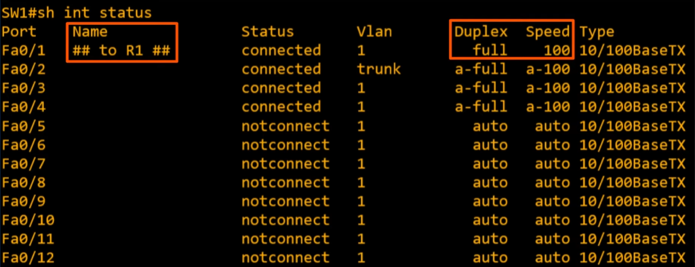

### Disabling unused interfaces

For security concerns we should disable the unused interfaces

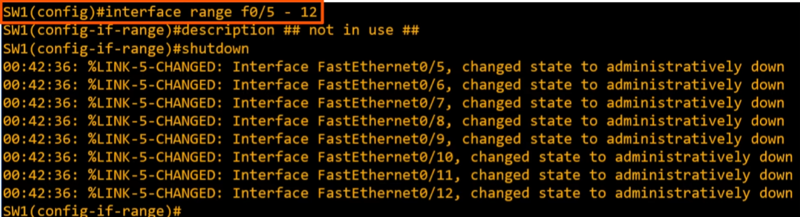

* `interface range f0/5 - 12` to select multiple interfaces at once (f0/5 to f0/12 in this one) 🔥🔥🔥
* `description <description>` to change the `name` field (description)
* `shutdown` to disable interfaces

## Full/Half Duplex

### Half Duplex
The device cannot send and receive data at the same time. If it is receiving a frame, it must want before sending a frame.

Half Duplex is pretty much unused in modern networks

#### LAN Hubs

In the past, **before network switches, HUBS were used**. Hubs acted as a repeater, meaning that any frame it receives is FLOODED. 🔥

1. `PC1` sends a frame for `PC2` and `PC3` sends a frame for `PC1`
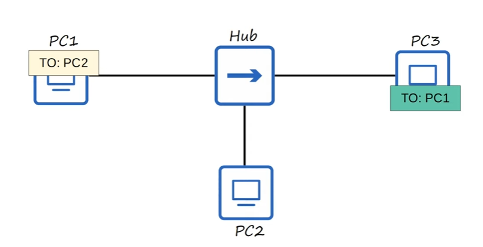

2. Both frames are sent through their network interfaces
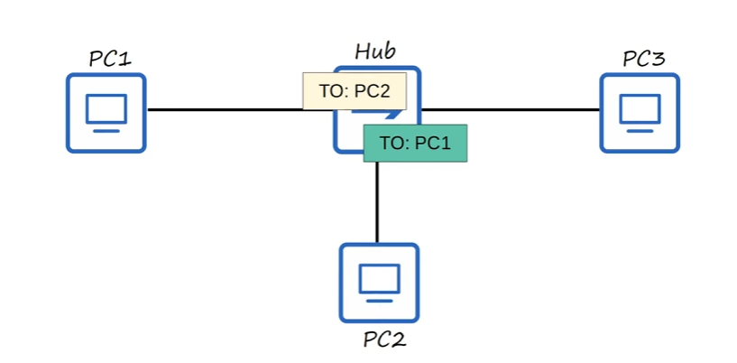

3. The Hub will try to `FLOOD` both at the same time resulting in a collision 🔥
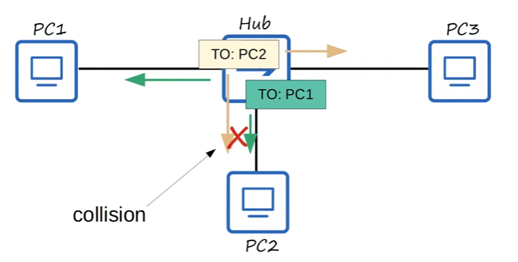

* **All devices connected to a Hub are part of something called a Collision Domain**
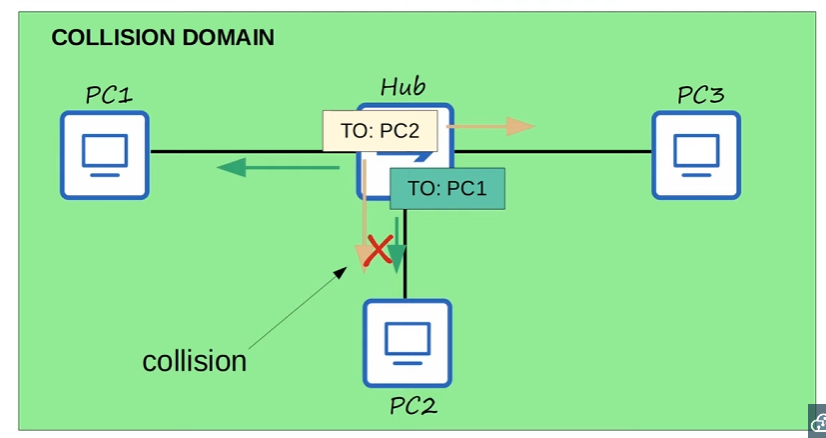

### Full Duplex

The device can send and receive data at the same time.

* Because of the improved functionality of Switches over Hubs, each connection to the switch is in its own Collision Domain. This means that devices don't need to worry about other devices sending data at the same time.
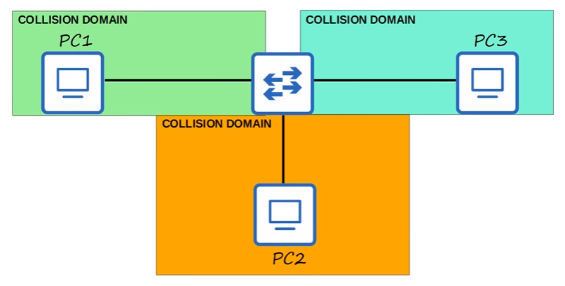

### CSMA/CD

To deal with colisions in a half-duplex situation like the one above, ethernet devices use a mechanism called CSMA/CD.

It stands for **Carrier Sense Multiple Access with Collision Detection** 🔥

* before sending frames, devices "listen" to the collision domain until they detect that other devices are not sending.
* if a collision does occur, the device sends a jamming signal to inform other devices that a collision happened.
* each device will wait a random period of time before sending frames again
* the process repeats

## Speed/Duplex Autonegotiation

* interfaces that run on different speeds (10/100 or 10/100/1000) have default settings of **speed auto** and **duplex auto**
* interfaces "*advertise*" their capabilities to the neighboring device, and they negotiate the best **speed** *and* **duplex** settings they are both capable of.

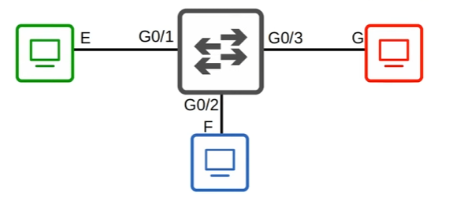
* E = 10 Mbps
* F = 10/100 Mbps
* G = 10/100/1000 Mbps

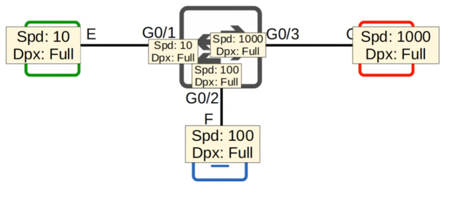
* **G0/1** will negotiate to a speed of **10 Mbps** and **full duplex**
* **G0/2** will negotiate to a speed of **100 Mbps** and **full duplex**
* **G0/3** will negotiate to a speed of **1000 Mbps** and **full duplex**

### What if autonegotiation is disabled on the device connected to the switch ?

* SPEED
    * The switch will try to sense the speed that the other device operating at 🔥
    * if it fails to sense the speed, it will use the slowest supported speed. (i.e. 10 Mbps in a 10/100/1000 interface)

* DUPLEX
    * If the speed is 10 or 100 Mbps, the switch will use half duplex 🔥🔥🔥
    * if the speed is 1000 Mbps or greater, the switch will use full duplex 🔥🔥🔥

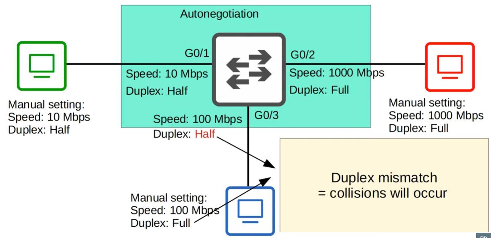

## Interface Errors 🔥🔥🔥

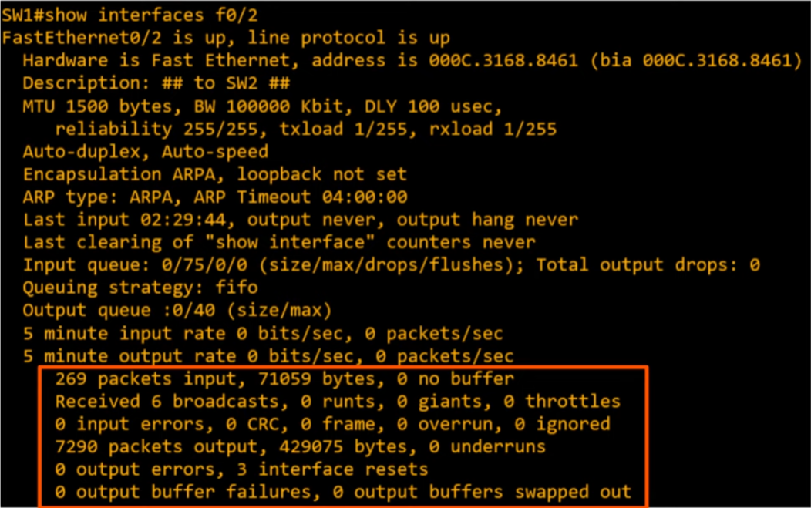

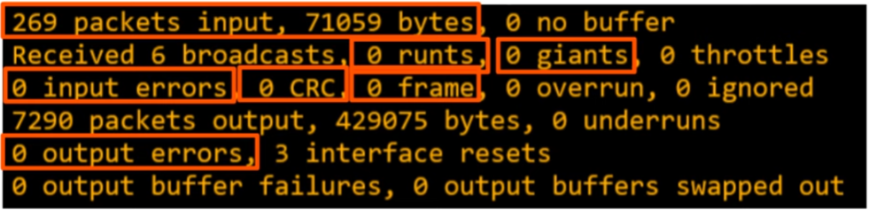

* `Runts`: frames that are smaller than the minimum frame size of 64 bytes
* `Giants`: frames that are larger than the maximum frame size of 1518 bytes
* `CRC`: frames that failed the CRC check (in the ethernet FCS trailer)
* `Frame`: frames that have an incorrect format (due to an error)
* `Input errors`: total of various counters, such as the above four
* `Output errors`: frames the switch tried to send, but failed due to an error
